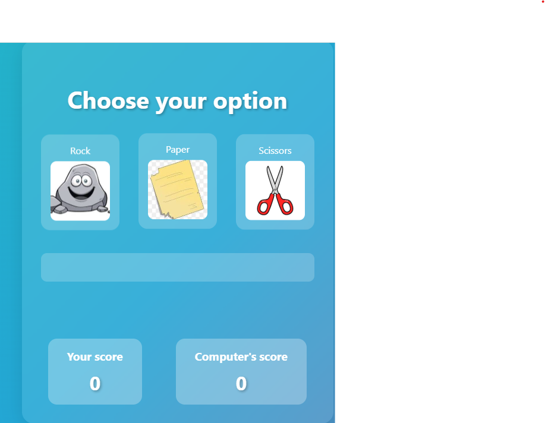
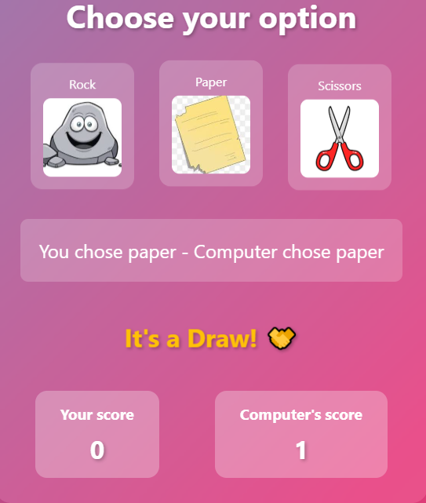
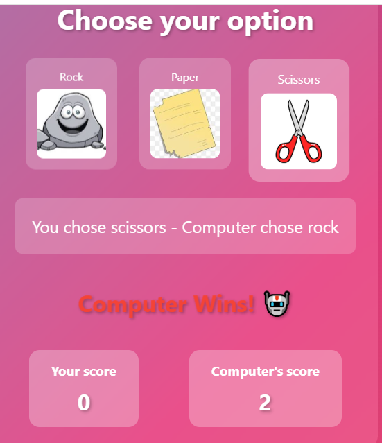

# [Project Name] 🎯

## Basic Details
### Team Name: [hanna]

### Team Members
- Member 1: [khadeejathul hanna] - [pptm college vengara ]
- Member 2: [Name] - [College]
- Member 3: [Name] - [College]

### Hosted Project Link
[mention your project hosted project link here]

### Project Description
[its a gamime rock paper scissor ]

### The Problem statement
[rock paper scissor game]

### The Solution

[making a web for the game]

## Technical Details
### Technologies/Components Used
For Software:
- [Languages used hdml,css,javascript]
- [Frameworks used]
- [Libraries used]
- [Tools used:text editor vs cord,note pade]

# Run
[ open index.html in any latest browser]

### Project Documentation
For Software:
html,css,javascript
# Screenshots ()

*home page of game*

*choosing option*

* score details*

# Diagrams

*Add caption explaining your workflow*

For Hardware:

# Schematic & Circuit

*Add caption explaining connections*

*Add caption explaining the schematic*

# Build Photos

*List out all components shown*

*Explain the build steps*

*Explain the final build*

### Project Demo
# Video
[demo](demo.mp4)
*demo video of gaming*

# Additional Demos
[Add any extra demo materials/links]

## Team Contributions
- [Name 1]: [Specific contributions]
- [Name 2]: [Specific contributions]
- [Name 3]: [Specific contributions]

---
Made with ❤️ at TinkerHub
